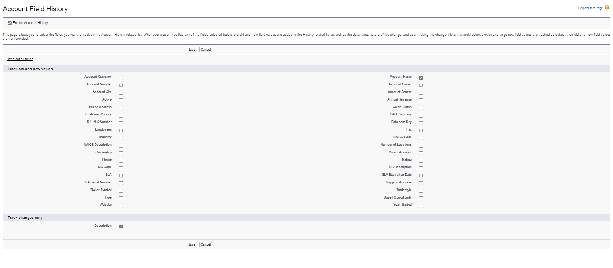
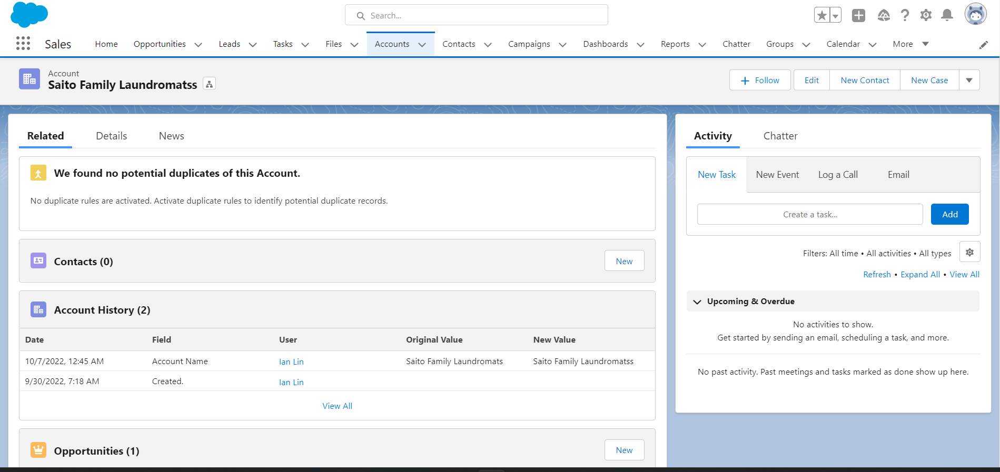
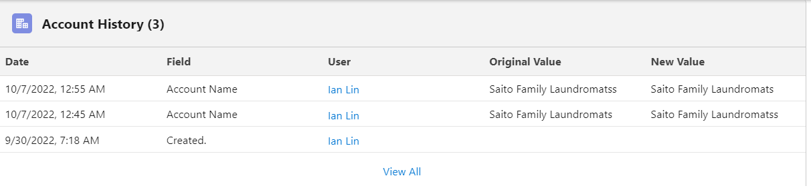
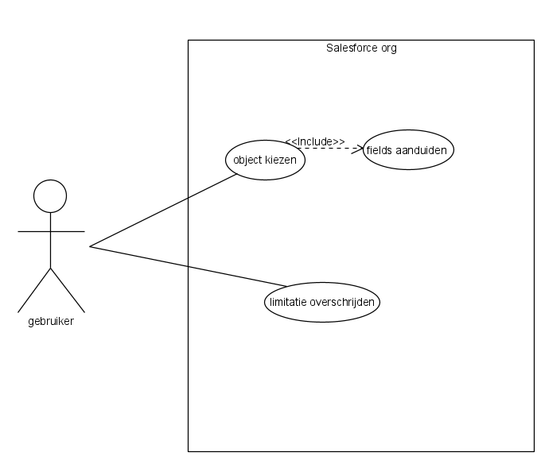
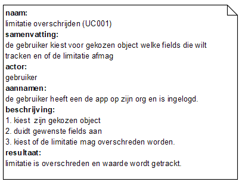
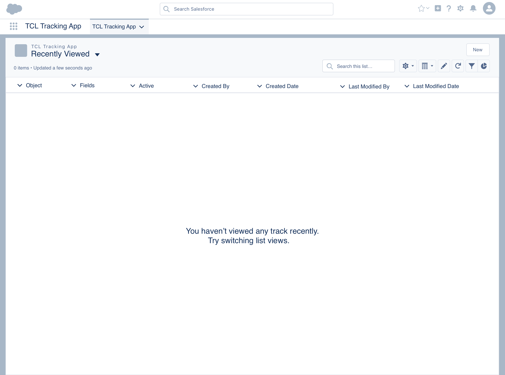
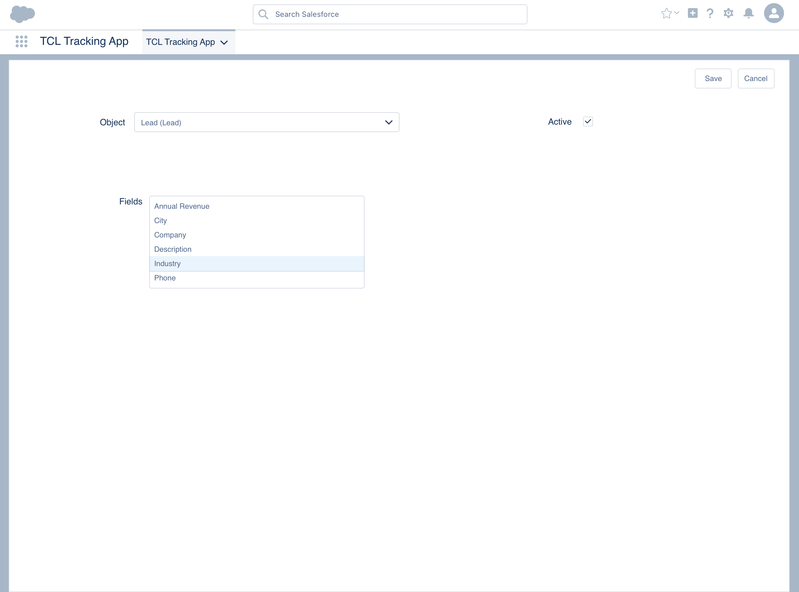
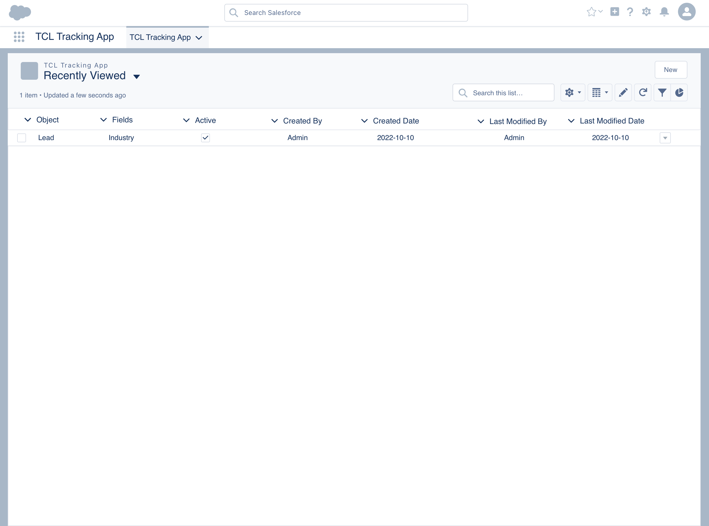
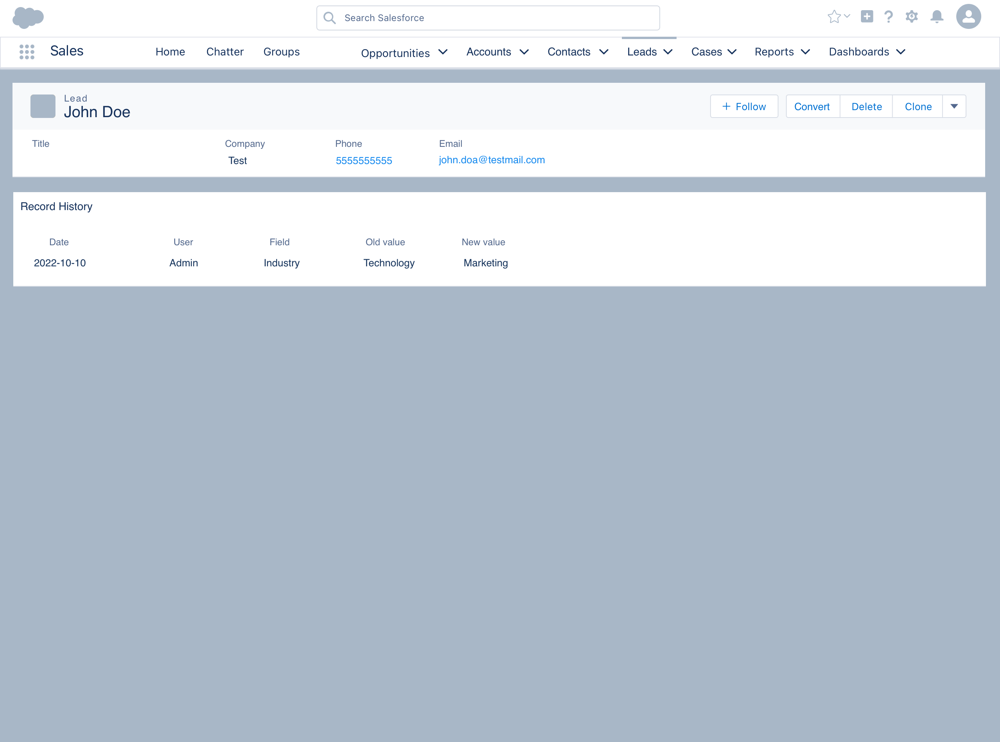

# 1 Project inleiding
 <h3>BluePrint: The Customer Link</h3>
 Wannes Strauven & Max Loubry
 Traject: Bachelor Toegepaste Informatica
 3ITBUS
 Alec Wuyts, Peter Zajc

# 2 Opdrachtgever
Voor het vak Applied Business Project kregen wij van opdrachtgever Alec Wuyts de
opdracht om een Salesforce package te maken.  Wij worden voor dit project begeleid en ondersteund door Peter Zajc.

# 3 Project woordenboek
| **Woord**            | **Betekenis**   |
| -------------------- | -----------|
| `Org` | Dit zijn de gegevens en metagegevens van uw specifieke organisatie. |
| `Standard Object` | Dit zijn objecten die standaard in Salesforce beschikbaar zijn. |
| `Custom Object`| Dit zijn de objecten die u zelf heeft aangemaakt. |
| `Field`| Velden in Salesforce vertegenwoordigen wat de kolommen vertegenwoordigen in relationele databases. |
| `Record`| Een record is een rij in de datastructuur van Salesforce. |
| `Package`| Is een pakket die kan worden geïnstalleerd op uw org zodat u de bijhorende functionaliteiten kan gebruiken. |
| `Field History Tracking`| U kunt bepaalde velden selecteren om de veldgeschiedenis hiervoor bij te houden. |
| `Lightning Web Components`| LWC is een front-end framework binnen Salesforce. |
| `Apex`| Is een object georiënteerd programmeertaal gemaakt door Salesforce. |
| `Sketch`|Is een tool om mock-ups te maken|
|`Mock-ups` | Een visuele voorstelling/design van een website/applicatie. |
| `Scope`| Wat wel en niet in het project zal worden opgenomen. |
| `Grafische gebruikersomgeving (GUI)`| Onderdeel van het besturingssysteem of apart programma dat de gebruiker in staat stelt opdrachten aan het systeem te geven door te klikken op grafische objecten (pictogrammen, menu's). |
| `Frontend`| Een gebruikersomgeving voor een applicatie, zoals een command-line-interface of een grafische gebruikersomgeving (GUI). |
| `Api`| Is een verzameling definities op basis waarvan een computerprogramma kan communiceren met een ander programma. |
| `Object permissions`| Specificeren de basistoegang die gebruikers hebben voor het maken, lezen, bewerken en verwijderen van records voor elk object. |
| `Field permissions`| Specificeren het toegangsniveau voor elk veld in een object. |
| `Org wide defaults`| Is het basisniveau van toegang dat de meest beperkte gebruiker zou moeten hebben. |
| `Role hierachy`| Is een mechanisme om de gegevenstoegang tot de records op een salesforce-object te regelen op basis van de functierol van een gebruiker. |
| `Sharing rules`| Dient voor deeltoegang uit te breiden van gebruikers in openbare groepen, rollen of gebieden. |
| `Manual sharing`| Records delen en beheren via de GUI.  |

# 4 Samenvatting
De klant Maakt gebruik van een SalesForce platform en heeft ons de taak gegeven om zijn platform-ervaring te verbeteren met wat meer mogelijkheden.
Hierdoor gaat hij en zijn medewerkers beter werk kunnen verrichten en grote fouten vermijden. 
We zijn welkom om te werken op zijn kantoor en maken hier wekelijks gebruik van om samen te kunnen zitten met de klant. 

# 5 Situatie As-Is 
De klant kan in zijn Salesforce platform gebruik maken van de Tracking history, die de aanpassingen van fields in een object bijhoudt en laat zien wanneer, wie
deze heeft aangepast. 

Hij kan op een object aanduiden welke fields hij wilt tracken en deze zullen dan als ze aangepast worden bijgehouden en getoont worden in de apps die gebruikt worden door de klant.

# 6 Probleemstelling
De functie History tracking heeft echter enkele uitzonderingen waar je als gebruiker rekening mee moet houden (zie Salesforce: Field History Tracking). 
Zo zal de functie niet meer dan 20 fields tegelijkertijd kunnen tracken.
Ook kan de field die getrackt wordt niet bestaan uit meer dan 255 characters, zo kunnen long text areas en andere grote waarden niet worden bijgehouden.
als de klant dan beschrijvingen van objecten of andere grote waardes wil bijhouden gaan die volgens de standaard regels van tracking history niet.

# 7 Situatie To-Be
Zoals er in het As-Is onderdeel staat van het document gaan we ervoor zorgen dat de limitaties worden overschreden met een salesforce applicatie.

## 7.1 Projectdefinitie
De limitatie op de grootte van de waarde is lastig als je beschrijvingsaanpassingen wilt documenteren in de tracking history.
de doelstelling is de gebruiker de keuze te laten maken om de limitatie van history tracking uit te zetten. Salesforce zelfhoudt dit tegen maar we gaan dit via een applicatie omzeilen. de gebruiker zal een kunnen kiezen of ze wel of niet gebruik gaan maken van de limitatieomzeiling door dit aan te duiden voor hun gekozen standaard of custom objecten. 

## 7.2 Scope
### 7.2.1 Functionaliteiten
- standaard en custom objecten kiezen.
- fields aanduiden.
- limitatie keuze aanduiden.
- bijhouden van de waardes.

### 7.2.2 use cases
De gebruiker maakt een keuze in de applicatie, deze kiest een object op welke de tracking moet gebeuren en welke fields hij graag wilt. 
Daarnaast kan hij ook aanduiden of ze de limiet willen overschrijden.

## 7.3 Nice to have
- Waarschuwing weergeven na keuze.
- Salesforce admin raadplegen voor extra opslag.

## 7.4 Assumpties
- De gebruiker heeft een geldige salesforce licentie.
- De beveiliging van de salesforce setup niet gewijzigd worden.

## 7.5 Niet in scope
- Verdere opleidingen worden niet gegeven.
- Verdere onderhoud van de applicatie zal niet worden voorzien na de oplevering.
- andere limitaties van salesforce over tracking worden niet verwerkt.

# 8 Planning

## 8.1 Hoofdlijnen
| **Onderdeel**            | **Deadline**   |
| -------------------- | -----------|
| Kick-off & Interview | `30/09/2022` |
| Blueprint | `14/10/2022` |
| Mockups | `14/10/2022` |
| **Tussentijdse evaluatie** | **`18/11/2022`** |
| Development | `21/10/2022` - `23/12/2022` |
| Testing | `16/12/2022` - `23/12/2022` |
| **Finale oplevering** | **`23/12/2022`** |

## 8.2 Toelichting fases

### 8.2.1 Analyse fase
Voor de analyse fase van dit project hebben we met de klant gesproken en dat hebben we de opdracht gekregen om op  een eenvoudige manier
field history tracking aan te kunnen zetten op alle object fields en datatypes, dit moet gebeuren via een zelfgemaakte package die wij in dit project zullen bouwen.

Voordat wij hiermee van start konden gaan hebben we eerst onderzoek gedaan naar de limitaties van Field History Tracking en waarom Salesforce
deze oplegt. Uit onze analyse is gebleken dat deze limitatie te maken heeft met de opslag van de org waarbij bijvoorbeeld een picklist of een rich text field meer opslag nodig heeft dan een gewone text field, dit zorgt ervoor dat het geheugen van de org sneller vol zou kunnen raken. Om dit probleem op te lossen trachten wij in de toekomst als nice to have functionaliteit de gebruiker de mogelijkheid te geven om via een zelfgemaakte tool bepaalde bestanden te verwijderen om zo terug geheugen vrij te maken. 

Ook hebben wij onderzocht welke technologie we het beste zouden gebruiken. Voor dit Salesforce project gaan we gebruik maken van LWC (Lightning Web Components) en de programmeertaal Apex. Hierover meer bij de Development fase.

### 8.2.2 Development fase
Voor de development fase gaan wij aan de slag met Lightning Web Components & Apex. Deze onderdelen zijn standaard beschikbaar in Salesforce, dit geeft ons de mogelijkheid om een package te bouwen voor dit project omdat we op deze manier rechtstreeks met de data van Salesforce kunnen werken.

# 9 Functioneel design
Voor de Salesforce mockups hebben we gebruik gemaakt van de tool "Sketch". Sketch maakt het mogelijk om elementen van Salesforce te
hergebruiken voor onze huidige designs. Dit maakt het ook makkelijk en herkenbaar voor zowel de developer als de gebruiker van de applicatie.

## 9.1 Home pagina
In deze mock-up kan u de home pagina van de applicatie vinden. Hierin komen de velden te staan die u wenst te tracken. Om een nieuw veld te tracken drukt u op de "New" knop, hiermee gaat u direct naar de setup pagina. 

## 9.2 Setup pagina
In deze mock-up kan u de setup pagina van de applicatie vinden. Hierin kan u Field History Tracking instellen op een bepaald object en dan vervolgens de fields selecteren die u graag wilt tracken. Vervolgens kan u ook aanduiden of u Field History Tracking wilt activeren op deze record.

## 9.3 Home pagina (tracking industry field op het lead object)
In deze mock-up kan u een testrecord vinden waarbij we het industrie veld gaan tracken van het lead object. 

## 9.4 Lead pagina (met het bijhorende Web Component)
In deze mock-up ziet u voorbeeld waarbij u het web component(Record History) kan toevoegen aan een pagina (in dit geval de lead page). Bij het component dat wij gaan bouwen krijgt u meteen te zien welke velden er gewijzigd zijn en ook door wie. 

# 10 Technisch design
## 10.1 gebruikte technologieën
### 10.1.1 Lightning Web Components (LWC) 
LWC is een front-end framework binnen Salesforce. Met dit framework 
kan er een UI gebouwd worden voor een applicatie. Het bouwen van de 
UI kan met html- en javascript code. Het is een vernieuwde versie van 
de  originele  Lightning  Components,  ook  Aura  Components  genoemd. 
De reden dat Salesforce een nieuw framework heeft gemaakt, is dat ze 
mee  moesten  gaan  met  de  nieuwste  technologieën.  LWC  gebruikt  nu 
Web Components technologieën en DOM rendering die zeer handig zijn 
voor  de  moderne  single-page  applicaties.  Ze  zijn  veel  sneller,  veiliger, 
gemakkelijker om mee te werken, herbruikbaar, bieden mobiele 
ondersteuning, enzovoort. (Voor meer informatie zie Christophe 
Coenraets. Introducing Lightning Web Components).

### 10.1.2 Apex 
Apex is een object georiënteerd programmeertaal dat in combinatie 
met een API calls kan uitvoeren op de Salesforce servers. De manier 
van code schrijven lijkt vrij goed op Java en gedraagt zich als database 
stored procedures. Business logica kan zo worden toegepast. 
Bijvoorbeeld een delete statement uitvoeren bij het drukken op een 
knop. (Voor meer informatie zie Salesforce. What is Apex?)

# 11 Beschrijving van de mogelijke interfaces
We maken enkel gebruik van Salesforce en de gegevens van de gebruiker intern op de opslag van hun platform. 

# 12 Beschrijving van eventuele datamigratie
Er zal in dit project geen datamigratie plaatsvinden. de applicatie gebruikt de plaatselijke data aanwezig.

# 13 Beschrijving van eventuele impact op de huidige infrastructuur
De applicatie gaat binnen een Salesforce omgeving gelanceerd worden, dus er zal geen 
externe server worden voorzien om de applicatie te draaien. Verder is het ook een component die los 
hangt van alle andere componenten, waardoor er geen conflicten ontstaan.

# 14 Analyse van security en eventuele autorisatierollen
Salesforce heeft een security model van zichzelf. dit model werkt op 3 lagen Object, Field en record en elke laag heeft zijn eigen
manier om data access toe te passen.
- Object
  - Object permissions
- Field
  - Field permissions
- Record
  - Org-wide defaults
  - Role hierarchy
  - Sharing rules
  - Manual sharing

# 15 Documentatie
Er zal een test worden voorzien na het maken van de applicatie en een user manual om de gebruiker van de applicatie goed wegwijs te maken.
